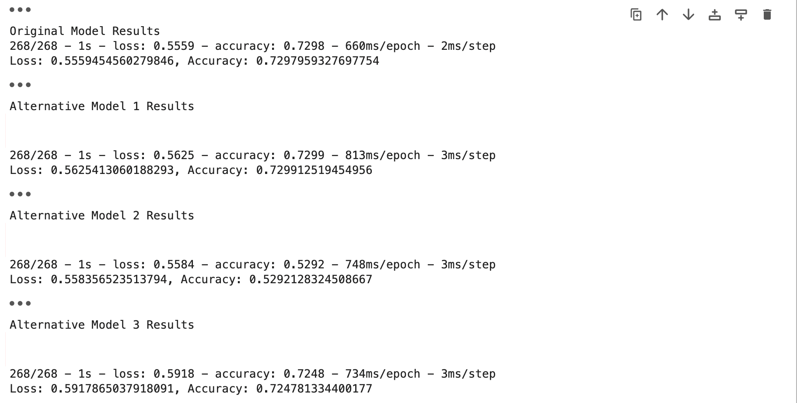

# Venture Funding with Deep Learning

## Case study

A venture capital firm is looking at using Deep Learning to help them process the funding applications they get from 
startups. The company would like a Model that can predict whether applicants will be successful if funded.

The prototype Model is created in a Jupyter notebook [venture_funding_with_deep_learning](venture_funding_with_deep_learning.ipynb)
using machine learning and neural networks techniques. Then a number of visualisations are used to evaluate the 
performance of the Model.

## Data sources

- Sample data of 34,000 organizations that have received funding over the years from the venture capital firm:
[applicants_data](Resources/applicants_data.csv)

## Tasks to support the Analysis of the data

- Preparing the data for use on a neural network model.
- Compiling and evaluating a binary classification model using a neural network.
- Optimising the neural network model.

## Technical Environment
This tool utilises the following technologies:
- **Pandas** [Documentation](https://pandas.pydata.org/docs/reference/frame.html)
- **Scikit learn** [Documentation](https://scikit-learn.org/stable/)
- **Tensorflow** [Documentation](https://www.tensorflow.org/)

## Disclaimer
> Please be aware this is an Academic Case Study. The conclusions from this work should not be considered as financial 
> advice.

---
## Report

### Model 1 - Summary

*HDF5 file*: [AlphabetSoup.h5](./Resources/AlphabetSoup.h5)

### Alternative Model 1 - Summary

Technique: 25% less nodes in the first layer, second layer with dropout of 2%, extra layer with regularization 

*HDF5 file*: [AlphabetSoup_alternative1.h5](./Resources/AlphabetSoup_alternative1.h5)

### Alternative Model 2 - Summary

Technique: Different activation function to output layer (softmax) and second hidden layer with double number of nodes

*HDF5 file*: [AlphabetSoup_alternative2.h5](./Resources/AlphabetSoup_alternative2.h5)

### Alternative Model 3 - Summary

Techniques: 1 less layer, 50% more nodes for the first hidden layer, double number of epochs (100)

*HDF5 file*: [AlphabetSoup_alternative3.h5](./Resources/AlphabetSoup_alternative3.h5)

### Analysis of performance across all Models

*Conclusion*
> After generating new variations of the original model, the Alternative Model 1 performed marginally better with an 
> accuracy of `72.99%` while our Original Model has an accuracy of `72.98%`.
> 
> Swapping the activation function to `softmax` for the output layer of Alternative Model 2 had a negative impact, 
> ending up with an accuracy of `52.92%` (`20%` lower than the Original Model). This model should be discarded.
> 
> As the alternative models didn't improve the performance, I would keep experimenting with combinations of Model 1 and
> Alternative Models 1 and 3. Perhaps combining these techniques will provide an optimised version of the original neural 
> network model that can be actually used to predict the success of the Startups. In the meantime, I don't recommend using
> any of the Models yet.